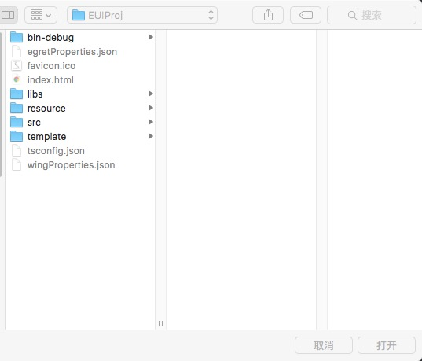

# Egret 工程导入插件

本插件用于将 Egret UI 工程导入 Cocos Creator 中。插件的作用是减少项目移植的工作量，并不能保证导入前后效果完全一致，请知悉。插件的安装请参考[文档](http://www.cocos.com/docs/creator/extension/install-and-share.html)。

## 环境要求

* Cocos Creator 1.2.1 以及以上版本
* 插件开发过程使用的是 Egret Engine 3.1.5

## 使用方法

1. 通过 Cocos Creator 菜单[文件]->[导入项目]->[导入 Egret 项目] 打开 Egret 项目选择面板，如下图：
	

2. 选择 Egret 项目文件夹之后，点击右下角 [打开] 按钮即可。

## 备注

* 导入过程中，在控制台面板会输出导入的进度信息。log 信息以 `Importing Egret project: [工程路径]` 起始，以 `Import Egret project finished.` 结束。
